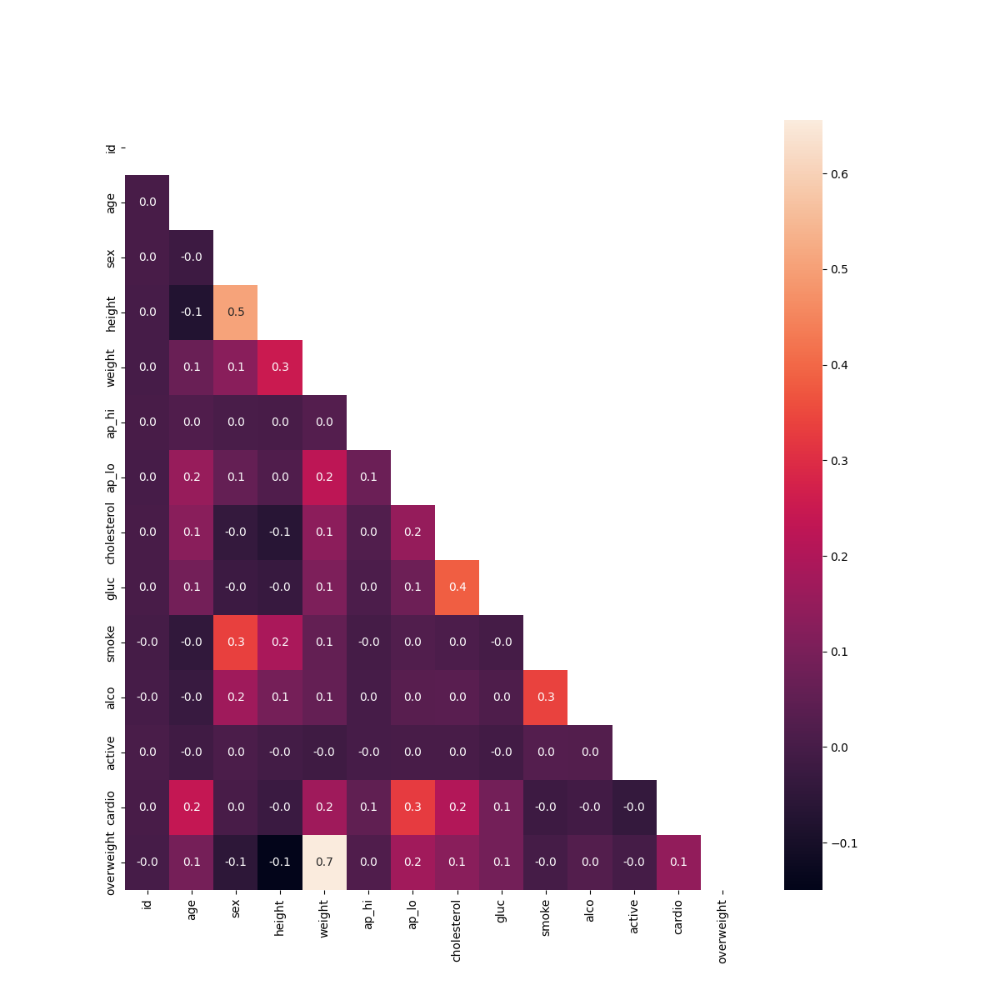

# Medical Examination Visualizer

## Problem
The goal of this project was to analyze and visualize medical examination data 
to discover relationships between cardiac disease, body measurements, blood 
markers, and lifestyle choices. The challenge required cleaning dirty data 
(such as nonsensical blood pressure readings) and normalizing features like 
cholesterol and glucose into binary values (0 for good, 1 for bad).

## What I built
A Python script that performs data preprocessing and generates two primary 
visualizations:
- Categorical plot: A bar chart displaying counts of health indicators 
  (cholesterol, glucose, smoking, alcohol, physical activity, and overweight) 
  grouped by whether the patient has cardiovascular disease.
- Heat map: A correlation matrix showing how strongly different variables 
  relate to each other, filtered to remove statistical outliers and masked 
  to hide the redundant upper triangle.

## How to run
```
python main.py
```

## Key concepts learned
- Data normalization: Calculating BMI to create an overweight column and 
  converting multi-categorical data into binary (0/1) format
- Data tidying: Using `pd.melt()` to pivot a DataFrame from wide to long 
  format, which is essential for seaborn's categorical plotting
- Statistical filtering: Using quantiles to remove the top and bottom 2.5% 
  of height and weight values before correlation analysis

## Key findings
- Age and cardiovascular disease show the strongest meaningful correlation (0.24)
- Diastolic and systolic blood pressure are strongly correlated (0.7) as expected
- Cholesterol and glucose show a moderate correlation (0.2)

## Output example

