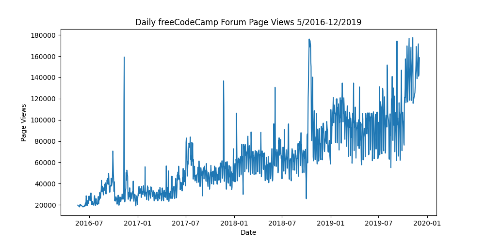
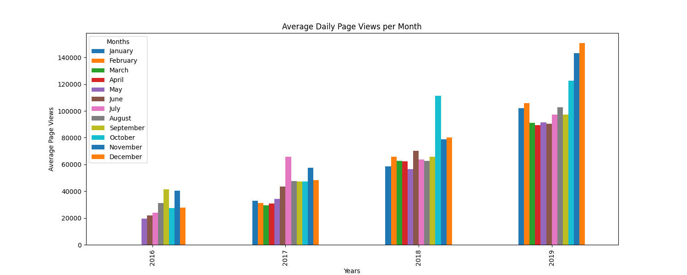
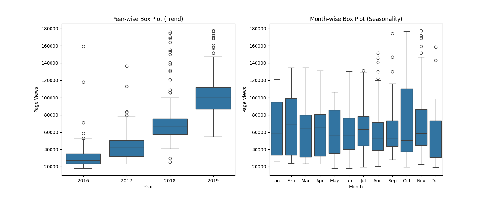

# Page View Time Series Visualizer

## Problem
This project involves visualizing daily freeCodeCamp forum traffic from 
mid-2016 to the end of 2019. The raw data contained outliers — certain 
days recorded extremely high or low visit counts, likely caused by site 
outages or bot traffic. To handle this, I filtered out the top and bottom 
2.5% of page view values before plotting to ensure the charts reflected 
genuine user activity.

## What I built
A Python-based data visualization script using Pandas, Matplotlib, and 
Seaborn to create three distinct views of the time series data:
- Line plot: A continuous chart tracking daily traffic over the 
  dataset period to visualize overall growth.
- Bar plot: A grouped monthly bar chart comparing average daily page views 
  of different years.
- Box plots: Two side-by-side box plots showing the distribution of page 
  views by year and by month.

## How to run
```
python main.py
```

## Key concepts learned
- Time series indexing: Parsing dates during CSV import using 
  `parse_dates=['date']` and setting the date column as the DataFrame 
  index for easier time-based manipulation
- Outlier filtering: Using `.quantile()` to exclude extreme high and low 
  values before visualization
- Data reshaping: Extracting year and month from the DateTime index, 
  grouping the data, and using `.unstack()` to format it for a grouped 
  bar chart
- Seaborn box plots: Using `order=` parameter to force correct month 
  ordering and `ax=` to place plots side by side in subplots

## Key findings
- Traffic peaks consistently in November each year, pointing to a 
  recurring seasonal spike likely tied to end-of-year learning activity
- The year-wise box plot shows a clear upward trend — each year's median 
  is noticeably higher than the one before it

## Output example


