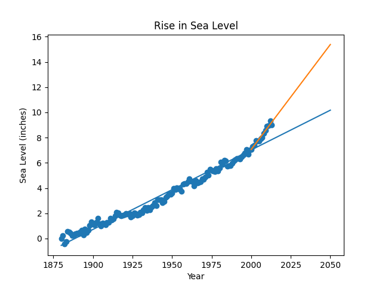

# Sea Level Predictor

## Problem
This project is about tracking how much the global sea level has changed 
since the late 1800s. I used a dataset from the EPA that has over a century 
of real-world measurements. The main problem was figuring out not just how 
much the water has risen, but how fast it's rising right now compared to 
the past, and using that to predict where the water level will be by 2050.

## What I built
A scatter plot of the dataset with two lines of best fit with different conditions drawn over it:
1. The historical line: Takes all data from 1880 and draws a straight line 
   predicting out to 2050. Shows the long-term, slow-and-steady trend over 
   the last century.
2. The modern line: Ignores the old data and only looks at trends from 
   the year 2000 onward till 2050. Shows the recent acceleration 
   in sea level rise in modern times.

## How to run
```
python main.py
```

## Key concepts learned
- Handling `linregress`: Using the `linregress` tool from SciPy was tricky 
  because it returns five values at once. 
- Filtering for recent data: Learned how to filter a DataFrame to only rows 
  from 2000 onwards and run a separate regression on that subset.

## Key findings
- An accelerating problem: When you focus only on data from the year 2000 
  onward, the angle of the line jumps up clearly pictures that 
  sea level rise is accelerating.
- Higher future predictions: Following the recent acceleration trend, the water will be 
  significantly higher by 2050 than the historical data originally predicted.

## Output example
